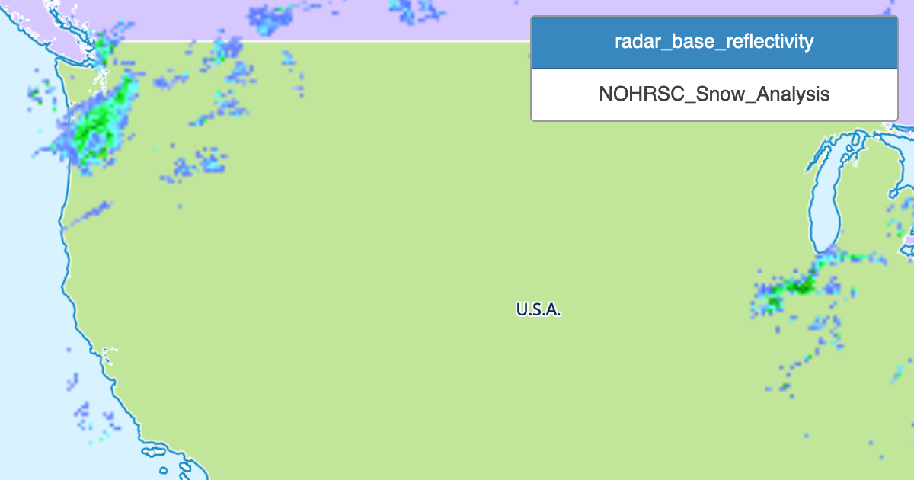
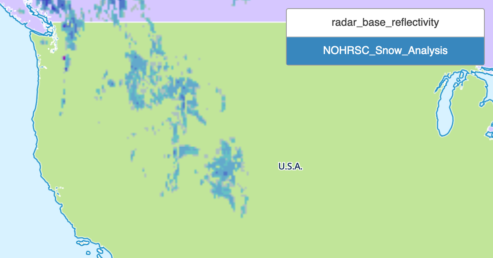
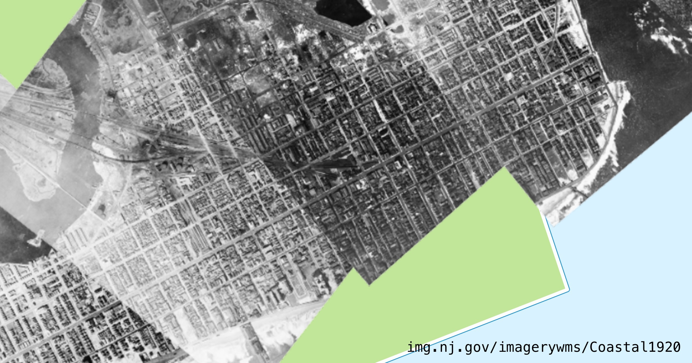
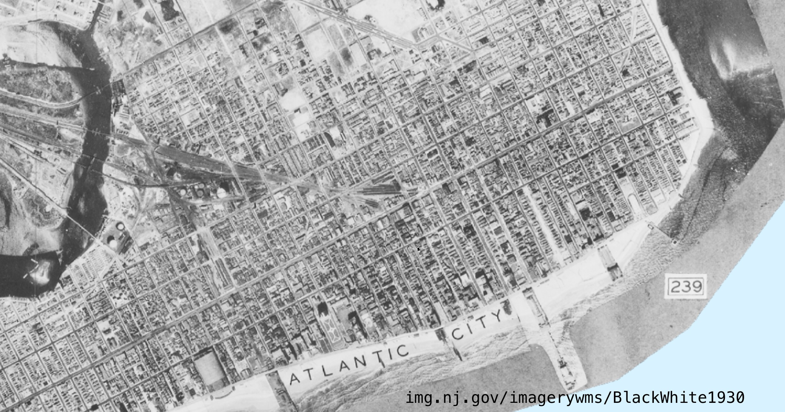
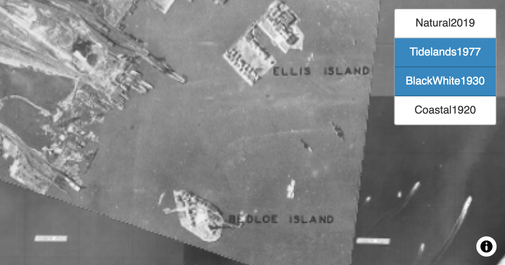
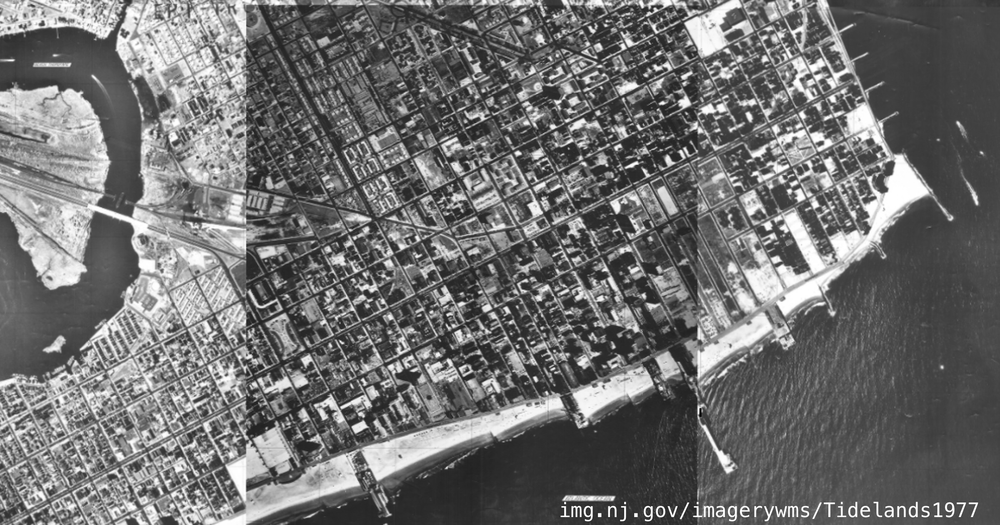
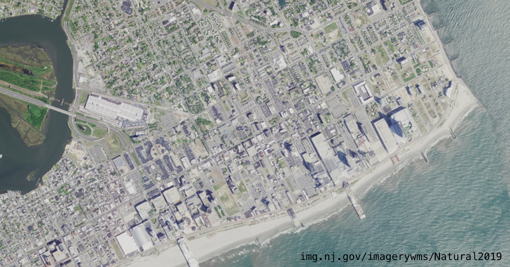

# WMS Plugin

This plugin designed for [MapLibre GL JS](https://maplibre.org) allows you to connect to map servers with the Web Map Service protocol.  For more information see the [WMS reference](https://docs.geoserver.org/stable/en/user/services/wms/reference.html) at GeoServer.org.

MapLibre has a support for pulling in [WMS as a `raster` type](https://maplibre.org/maplibre-gl-js-docs/example/wms/).  With this plugin, you only need the URL of the service, the layer you want to show, and the image format.  This plugin allows more flexibility in building up the WMS request by setting values in `WmsApiLayerOptions`, and the plugin will build up the rest of the request details.

## Usage

```JavaScript
// Add WMS as map type to MapLibre GL JS
map.addSourceType('wms', WmsSource(maplibregl), (e) => e && console.error('There was an error', e));
```

## Live Demo

<!-- TODO:  change `roblabs` to `nationalparkservice` when PR lands -->
* https://raw.githack.com/roblabs/npmap5-plugins/maplibre-gl-wms-source/examples/index.html
* https://raw.githack.com/roblabs/npmap5-plugins/maplibre-gl-wms-source/examples/nj.html
* https://raw.githack.com/roblabs/npmap5-plugins/maplibre-gl-wms-source/examples/noaa.html

---

## NOAA Example

### `WMS_Capabilities`

This examples tests WMS version `1.3.0`.

This link fetches the capabilities of the NWS Observations from NOAA in XML format.

* https://idpgis.ncep.noaa.gov/arcgis/services/NWS_Observations/radar_base_reflectivity/MapServer/WMSServer?request=GetCapabilities&service=WMS

Add  *Radar Base Reflectivity* data from the [National Weather Service](https://opengeo.ncep.noaa.gov/geoserver/www/index.html).  See details:

* https://idpgis.ncep.noaa.gov/arcgis/rest/services
* https://idpgis.ncep.noaa.gov/arcgis/rest/services/NWS_Observations

### Usage

```JavaScript
// Adds a source to the map's style.
//   https://maplibre.org/maplibre-gl-js-docs/api/map/#map#addsource
map.addSource('noaaWMS', {
    'type': 'wms',
    'url': 'https://idpgis.ncep.noaa.gov/arcgis/services/NWS_Observations/radar_base_reflectivity/MapServer/WMSServer',
    'layers': [1],  // determine this by inspecting the XML
    'tileSize': 256
});

// Adds a MapLibre style layer to the map's style.
//   https://maplibre.org/maplibre-gl-js-docs/api/map/#map#addlayer
map.addLayer({
    "id": "noaaWMSLayer",
    "source": "noaaWMS",
    "type": "raster"
});
```

NOAA also has snow analysis data from the [National Operational Hydrologic Remote Sensing Center](https://www.nohrsc.noaa.gov/nsa/).

* https://idpgis.ncep.noaa.gov/arcgis/rest/services/NWS_Observations/NOHRSC_Snow_Analysis/MapServer

```JavaScript
// Adds a source to the map's style.
//   https://maplibre.org/maplibre-gl-js-docs/api/map/#map#addsource
map.addSource('noaaWMS', {
    'type': 'wms',
    'url': 'https://idpgis.ncep.noaa.gov/arcgis/services/NWS_Observations/NOHRSC_Snow_Analysis/MapServer/WMSServer',
//    'layers': [0, 3];  // "Snow Depth", determine this by inspecting the XML
    'layers': [4, 7],    // "Snow Water Equivalent", determine this by inspecting the XML
    'tileSize': 256,
    'format': 'png'
});

// Adds a MapLibre style layer to the map's style.
//   https://maplibre.org/maplibre-gl-js-docs/api/map/#map#addlayer
map.addLayer({
    "id": "noaaWMSLayer",
    "source": "noaaWMS",
    "type": "raster"
});
```

---

### Image Formats

See the console log for the supported formats from the WMS.

> Image Formats 
Array(9) [ "image/bmp", "image/jpeg", "image/tiff", "image/png", "image/png8", "image/png24", "image/png32", "image/gif", "image/svg+xml" ]
 version 1.3.0

## Examples of NOAA WMS

*CONUS 1x1 km base reflectivity doppler radar. This data is provided Mutil-Radar-Multi-Sensor (MRMS) algorithm.*


*This service consists of four maps of snow characteristics for the coterminous U.S.: snow water equivalent, snow depth, mean snowpack temperature and snowmelt.*


---

## NJ.gov Example

### `WMT_MS_Capabilities`

This examples tests WMS version `1.1.1`.

This link fetches the capabilities of the NWS Observations from [NJ Geographic Information Network](https://njgin.nj.gov/njgin/edata/imagery/) in XML format.

```JavaScript
// Adds a source to the map's style.
//   https://maplibre.org/maplibre-gl-js-docs/api/map/#map#addsource
map.addSource(layer, {
    'type': 'wms',
    'tileSize': 256,
    'url': 'https://img.nj.gov/imagerywms/Natural2019',
    'layers': ['Natural2019'], // determine this by inspecting the XML
    'format': 'png',
});

// Adds a MapLibre style layer to the map's style.
//   https://maplibre.org/maplibre-gl-js-docs/api/map/#map#addlayer
map.addLayer({
    "id": 'Natural2019',
    "source": 'Natural2019',
    "type": "raster",
});
```

### Image Formats

See the console log for the supported formats from the WMS.

> Image Formats 
Image Formats 
Array(4) [ "image/jpeg", "image/tiff", "image/png", "image/jp2;subtype=\"gmljp2\"" ]
 version 1.1.1

## Examples of NJ.gov WMS

*This service provides access to a raster dataset containing scanned and georeferenced black and white aerial photographs of the Atlantic coast of New Jersey. Photograph date is believed to be 1920, based upon hand-written notation on some of the storage envelopes.*


---

*This OGC compliant Web Map Service includes a historical image data set of a mosaic of black and white photography of New Jersey from the early 1930s. The source imagery was hand cut to produce 261 mosaic tile prints on linen-backed paper. The data set was produced by scanning these mosaic tile prints at 400 dpi and saved as TIFF images.*


---

*Ellis Island, 1930*


*This Web Map Service publishes the series of chronopaque photo-basemaps known as the "1977 Tidelands Basemaps."*


---

*Ellis Island, 1977*


*This service provides natural color imagery from the 2019 National Agriculture Imagery Program (NAIP). The NAIP acquires and publishes ortho imagery that has been collected during the agricultural growing season in the U.S.*


---

## API

<!-- Generated by documentation.js. Update this documentation by updating the source code. -->

- [WMS Plugin](#wms-plugin)
  - [Usage](#usage)
  - [Live Demo](#live-demo)
  - [NOAA Example](#noaa-example)
    - [`WMS_Capabilities`](#wms_capabilities)
    - [Usage](#usage-1)
    - [Image Formats](#image-formats)
  - [Examples of NOAA WMS](#examples-of-noaa-wms)
  - [NJ.gov Example](#njgov-example)
    - [`WMT_MS_Capabilities`](#wmt_ms_capabilities)
    - [Image Formats](#image-formats-1)
  - [Examples of NJ.gov WMS](#examples-of-njgov-wms)
  - [API](#api)
    - [service](#service)
    - [version](#version)
    - [request](#request)
    - [layers](#layers)
    - [styles](#styles)
    - [srs](#srs)
    - [bbox](#bbox)
    - [width](#width)
    - [height](#height)
    - [format](#format)
    - [transparent](#transparent)
    - [bgcolor](#bgcolor)
    - [exceptions](#exceptions)
    - [time](#time)
    - [sld](#sld)
    - [sld\_body](#sld_body)

### service

Service name. Value is WMS.

Type: `"WMS"`

### version

Service version. Value is one of 1.0.0, 1.1.0, 1.1.1, 1.3.0.

Type: (`"1.0.0"` | `"1.1.0"` | `"1.1.1"` | `"1.3.0"`)

### request

Operation name. Value is GetMap.

Type: `"GetMap"`

### layers

Layers to display on map.Value is a comma - separated list of layer names.

Type: [string](https://developer.mozilla.org/docs/Web/JavaScript/Reference/Global_Objects/String)

### styles

Styles in which layers are to be rendered.Value is a comma - separated list of style names,
or empty if default styling is required.Style names may be empty in the list,
to use default layer styling.

Type: [string](https://developer.mozilla.org/docs/Web/JavaScript/Reference/Global_Objects/String)

### srs

Spatial Reference System for map output.Value is in form EPSG: nnn.

Type: [string](https://developer.mozilla.org/docs/Web/JavaScript/Reference/Global_Objects/String)

### bbox

Bounding box for map extent.Value is minx, miny, maxx, maxy in units of the SRS.

Type: [string](https://developer.mozilla.org/docs/Web/JavaScript/Reference/Global_Objects/String)

### width

Width of map output, in pixels.

Type: [string](https://developer.mozilla.org/docs/Web/JavaScript/Reference/Global_Objects/String)

### height

Height of map output, in pixels.

Type: [string](https://developer.mozilla.org/docs/Web/JavaScript/Reference/Global_Objects/String)

### format

Format for the map output.

Type: [string](https://developer.mozilla.org/docs/Web/JavaScript/Reference/Global_Objects/String)

### transparent

Whether the map background should be transparent.Values are true or false.Default is false

Type: [boolean](https://developer.mozilla.org/docs/Web/JavaScript/Reference/Global_Objects/Boolean)

### bgcolor

Background color for the map image.Value is in the form RRGGBB.Default is FFFFFF(white).

Type: [string](https://developer.mozilla.org/docs/Web/JavaScript/Reference/Global_Objects/String)

### exceptions

Format in which to report exceptions.Default value is application / vnd.ogc.se\_xml.

Type: [string](https://developer.mozilla.org/docs/Web/JavaScript/Reference/Global_Objects/String)

### time

Time value or range for map data.

Type: [string](https://developer.mozilla.org/docs/Web/JavaScript/Reference/Global_Objects/String)

### sld

A URL referencing a StyledLayerDescriptor XML file which controls or enhances map layers and styling

Type: [string](https://developer.mozilla.org/docs/Web/JavaScript/Reference/Global_Objects/String)

### sld\_body

A URL - encoded StyledLayerDescriptor XML document which controls or enhances map layers and styling

Type: [string](https://developer.mozilla.org/docs/Web/JavaScript/Reference/Global_Objects/String)
